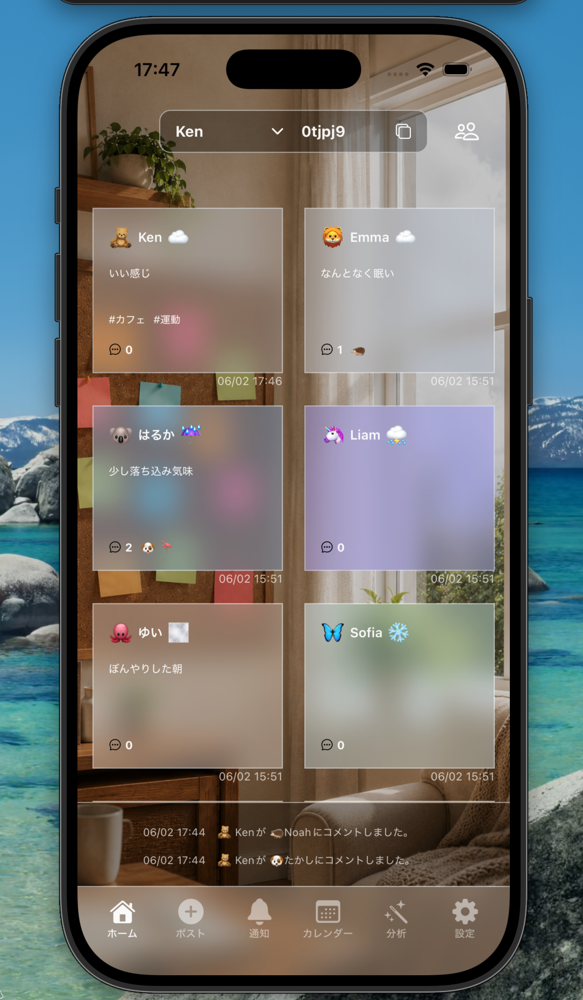
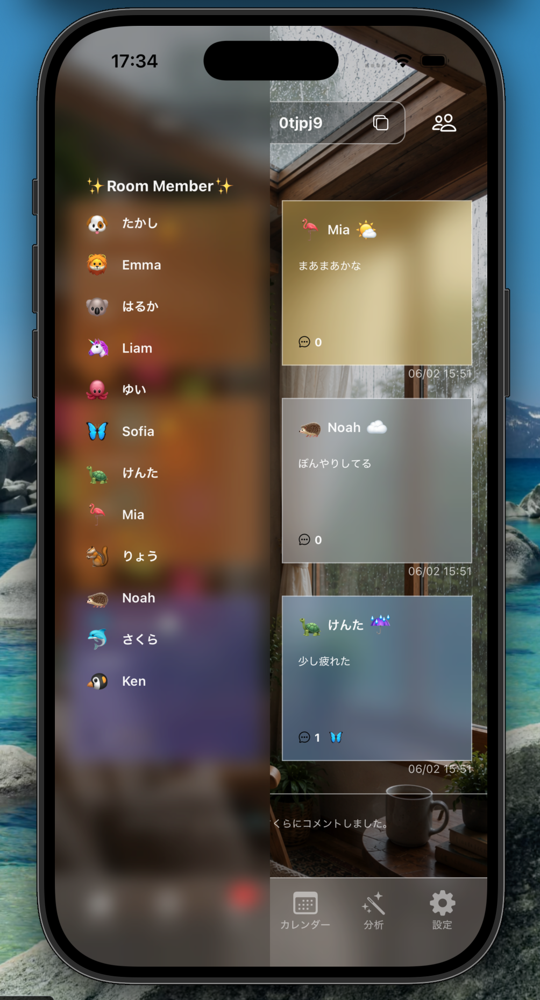
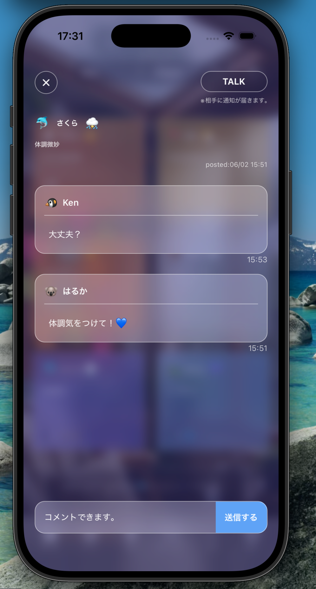
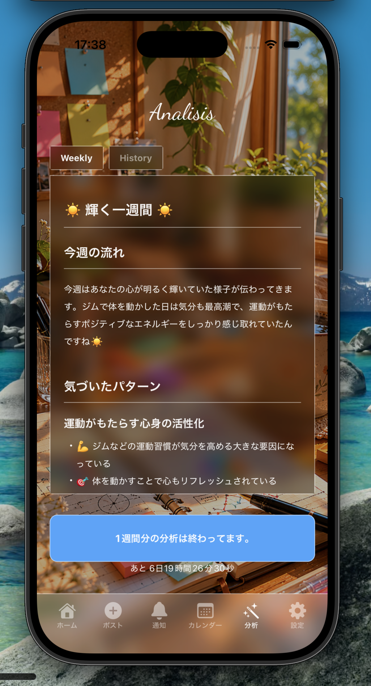
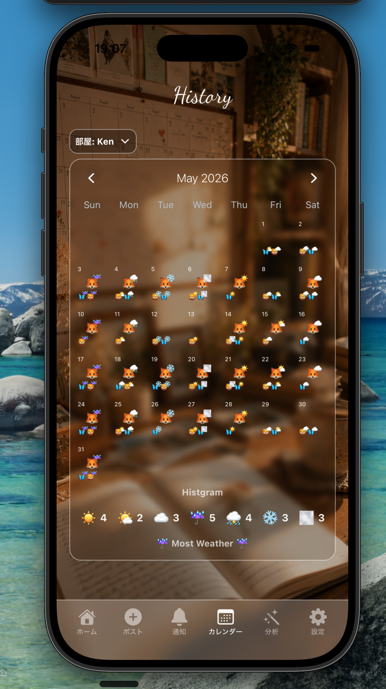
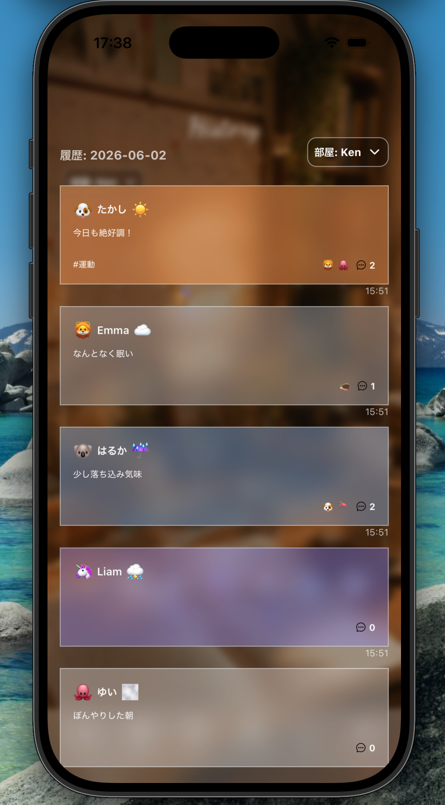
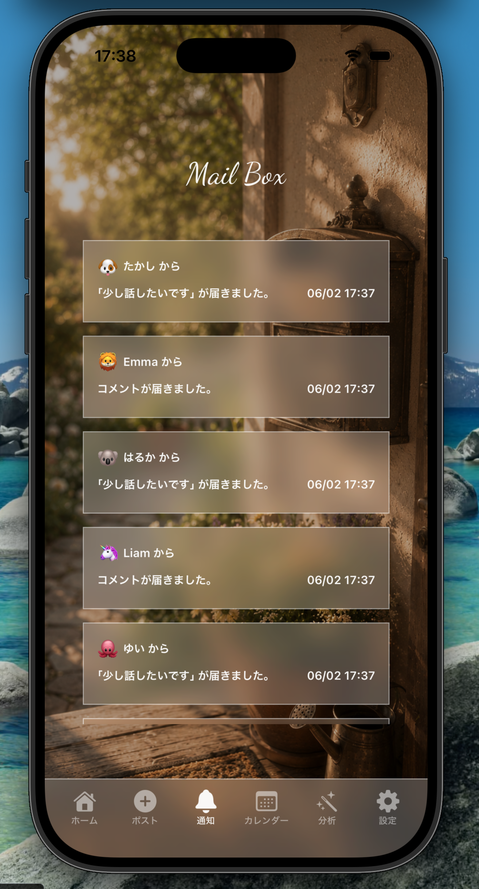
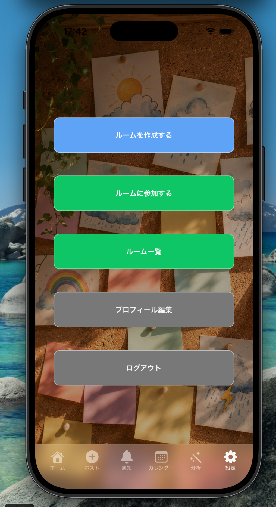

# Weather Board

感情を「天気」で表現して、グループで共有するシェアハウス型アプリ。
天気みたいに気分は毎日変わる。だから気軽に、正直に共有できる。

## できること

- 自分の気分を天気で投稿して、グループメンバーと共有
- 投稿の天気に応じて付箋の色や背景が変わるビジュアル表現
- 投稿にコメントを残したり、「ちょっと話したい」通知を送れる
- 通知はアプリ内・プッシュ通知の両方で受け取れる
- 絵文字でアバターを作成してプロフィールをカスタマイズ
- ルームを作成・参加して、グループを分けて管理（上限なし）
- ルームの招待コードをコピーしたり、ルーム一覧から削除が可能
- 投稿にアクティビティタグを付けて記録
- 1週間分の投稿をもとに AI が分析・アドバイスを生成
- ヒストリーカレンダーで1ヶ月分の天気ログを振り返り

## スクリーンショット

| ホーム | ホーム（コメント） | 投稿 |
|---|---|---|
|  |  |  |

| AI分析 | AI分析（履歴） | ヒストリーカレンダー |
|---|---|---|
|  |  |  |

| カレンダー詳細 | 通知 | 設定 |
|---|---|---|
|  |  |  |

## 技術スタック

- React Native
- Expo / Expo Router
- TypeScript
- Supabase（DB・認証・Realtime・Edge Functions）
- PostgreSQL
- Anthropic Claude API
- Expo Push Notifications
- NativeWind

## セットアップ

```bash
# パッケージのインストール
npm install

# 環境変数の設定
cp .env.example .env
# .env に Supabase の URL・APIキー・Anthropic APIキーを記入

# 起動
npx expo start
```

## 作者

GitHub: [Kensuke775](https://github.com/Kensuke775)
