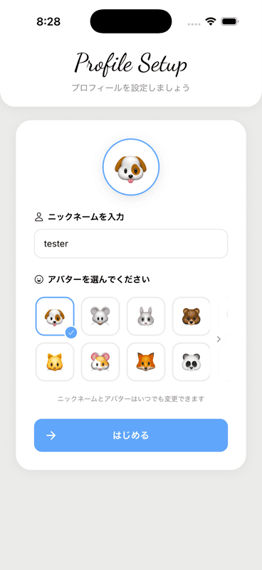

# Weather Board

感情を「天気」で表現して、グループで共有するシェアハウス型アプリ。
天気みたいに気分は毎日変わる。
Weather Boardは気軽に、正直に共有できる。

メール/Google/Appleでの認証、AIによる週次分析、EULA同意・通報・ブロックなどの安全対策まで実装しています。

**制作期間**：2026年3月〜2026年6月（約3ヶ月、個人開発）

**App Store**：[Weather Board](https://apps.apple.com/jp/app/id6782014446)

**デモ用ルーム**（一時公開・ダミーデータ）：ルーム名「Demo」／招待コード `demo11`

## スクリーンショット

| ホーム | 投稿 | ヒストリーカレンダー |
|---|---|---|
|  |  |  |

| AI分析 | 通知 | ログイン |
|---|---|---|
|  |  |  |

| サインアップ | プロフィール設定 | 設定 |
|---|---|---|
|  |  |  |

## 制作のきっかけ

海外のシェアハウスで、毎朝付箋に気分を書いてボードに貼り、住人同士で共有する「Weather Board」という文化を見たことが着想のきっかけです。言葉で直接は言いづらい気持ちも、天気というワンクッションを置くことで、相手の方から気づいて声をかけてもらえる。そんな間接的なコミュニケーションをデジタルで実現したいと思い、開発しました。

## 技術スタック

- React Native / Expo / Expo Router — Flutter（Dart習得コスト）やNative（Swift/Kotlinの二重学習コスト）と比較し、もともとJS/TSの知識があったため選択。1コードベースで両OS対応でき、UIもReactライクに書けるため管理しやすい。SupabaseのJS SDKも、別言語向けラッパーを用意せずそのまま利用できる点も決め手
- TypeScript — 型安全性により実行前にバグを検知できる。Zodのスキーマ定義から型を自動推論できるなど、下記のZod導入とも相性が良いため採用
- Supabase（DB・認証・Realtime・Edge Functions） — DB・認証・Realtime・サーバーレス関数を1つのBaaSでまとめて使え、個人開発でも無料枠内で運用できるため採用。公式JS SDKがReact Nativeにそのまま組み込める点も決め手
- PostgreSQL — Supabase採用に伴うデータベース。ルーム・メンバー・投稿・コメントなど多対多のリレーションが多いデータ構造のため、リレーショナルDBが適していると判断
- Google OAuth（expo-auth-session） — 多くのユーザーが普段使っているGoogleアカウントでログインでき、新規登録のハードルを下げるため導入
- Sign in with Apple（expo-apple-authentication） — 外部認証(Google等)を提供する場合、App Store審査ガイドライン(Guideline 4.8)によりSign in with Appleの提供が実質必須。実際にApp Review側からも指摘を受け対応した
- Anthropic Claude API — （検討中）
- Zod（Edge Functionの入力・外部APIレスポンスのバリデーション） — TypeScriptとの親和性が高く、スキーマ定義から型を自動生成できるため、Edge Functionが受け取る外部データ(プッシュ通知リクエスト、Claude APIレスポンス)の検証に採用
- Firebase Cloud Messaging（Android プッシュ通知） — （検討中：Expo Pushと分けた経緯）
- Expo Push Notifications（iOS プッシュ通知） — （検討中：Expo Pushと分けた経緯）
- NativeWind — UIライブラリはGlueStack UIを優先しつつ、実装が難しい・詰まった箇所のフォールバックとして採用

## できること

- 自分の気分を天気で投稿して、グループメンバーと共有
- 投稿の天気に応じて付箋の色や背景が変わるビジュアル表現
- アクティビティフィードでメンバー全員の最新投稿をすぐ確認できる
- 投稿にコメントを残したり、「ちょっと話したい」通知を送れる
- 設定画面からルームを作成・参加でき、グループを分けて管理（上限なし、名前変更・退出にも対応）
- 投稿にアクティビティタグを付けて記録・削除も可能
- ヒストリーカレンダーで1ヶ月分の天気ログを振り返り
- 登録前に利用規約（EULA）への同意を必須化
- 不適切な投稿・コメント・ユーザーを通報できる仕組み
- 迷惑なユーザーをブロックでき、ブロック相手の投稿・コメント・タグを即時非表示
- 自分の投稿・コメントを削除できる
- 設定からアカウントを削除でき、関連データも完全に削除される

## こだわったところ

- 通報・ブロック・EULA同意の必須化など、安全に使えるための対策を一通り実装
- Google・Apple の2方式でログイン可能
- 1週間分の投稿をもとにAIが分析・アドバイスを生成
- 白・黒・青を基調としたデザインシステムに統一し、色やカードスタイルを再利用可能なトークンとして定義してUIの一貫性を担保
- メール登録時はEULA同意をフォームに組み込んで画面遷移を1つ削減しつつ、Google/Appleログイン時は別画面でEULAを提示するなど、経路ごとに最適な導線を設計
- オンボーディングはアバター設定のみに絞り込み、ルーム作成・参加は任意のタイミングで設定画面から行えるようにして離脱を防ぐ設計
- 投稿・コメント入力時、iOS/Android両方でキーボードに入力欄が隠れないよう自動調整
- ニックネームなどの文字数制限、長いテキストの省略表示・折り返しなど、iOS/Android両方で表示崩れを防ぐUI対応
- iOS・Android両方の実機で動作確認済み
- Edge Functionでは、外部から受け取るデータ（プッシュ通知リクエストの中身、Claude APIの返答形式）をZodでバリデーションし、想定外の形式を早期に検知

## テストについて

`lib/date.ts`の日付・時間帯判定や、通知画面の遷移先判定・グルーピング・フィルタリングロジックなど、Supabase等の副作用を持たない純粋関数についてはJest（jest-expo）でユニットテストを導入しています。GitHub Actions上でpush・PRのたびに自動実行されます。

```bash
npm run test
```

一方、UIの表示崩れやSupabase Realtimeとの連携など、実機でしか確認しづらい部分は、引き続き以下の観点を手動で確認しています。

- **日付の境界**：AI分析の週次実行制限、ヒストリーカレンダーの月切り替えなど、実機の日付を変更してSupabase上のデータと合わせて動作確認
- **接続・Realtime**：複数アカウントを同時に使い、Supabase Realtime経由での投稿・コメント・ブロックなどの即時反映を確認
- **表示崩れ**：長いニックネーム・長いコメント・複数行のテキストなどを実際に入力し、レイアウトが崩れないことを確認
- **API通信**：Claude API（AI分析）、Expo Push API（プッシュ通知）について、実際にリクエストを送って正常にレスポンス・通知が返ってくることを実機で確認

## セットアップ

```bash
# パッケージのインストール
npm install

# 環境変数の設定
cp .env.example .env
# .env に Supabase の URL・APIキー・Anthropic APIキーを記入

# 起動
npx expo start
```

## 作者

GitHub: [Kensuke775](https://github.com/Kensuke775)
