# Weather Board

感情を「天気」で表現して、グループで共有するシェアハウス型アプリ。
天気みたいに気分は毎日変わる。
Weather Boardは気軽に、正直に共有できる。

メール/Google/Appleでの認証、AIによる週次分析、EULA同意・通報・ブロックなどの安全対策まで実装しています。

**制作期間**：2026年3月〜2026年6月（約3ヶ月、個人開発）

**App Store**：[Weather Board](https://apps.apple.com/jp/app/id6782014446)

**デモ用ルーム**（一時公開・ダミーデータ）：ルーム名「Coffee」／招待コード `0tjpj9`

## 制作のきっかけ

海外のシェアハウスで、毎朝付箋に気分を書いてボードに貼り、住人同士で共有する「Weather Board」という文化を見たことが着想のきっかけです。言葉で直接は言いづらい気持ちも、天気というワンクッションを置くことで、相手の方から気づいて声をかけてもらえる。そんな間接的なコミュニケーションをデジタルで実現したいと思い、開発しました。

## 技術スタック

- React Native
- Expo / Expo Router
- TypeScript
- Supabase（DB・認証・Realtime・Edge Functions）
- PostgreSQL
- Google OAuth（expo-auth-session）
- Sign in with Apple（expo-apple-authentication）
- Anthropic Claude API
- Zod（Edge Functionの入力・外部APIレスポンスのバリデーション）
- Firebase Cloud Messaging（Android プッシュ通知）
- Expo Push Notifications（iOS プッシュ通知）
- NativeWind

## できること

- 自分の気分を天気で投稿して、グループメンバーと共有
- 投稿の天気に応じて付箋の色や背景が変わるビジュアル表現
- アクティビティフィードでメンバー全員の最新投稿をすぐ確認できる
- 投稿にコメントを残したり、「ちょっと話したい」通知を送れる
- ルームを作成・参加して、グループを分けて管理（上限なし）
- 投稿にアクティビティタグを付けて記録・削除も可能
- ヒストリーカレンダーで1ヶ月分の天気ログを振り返り
- 登録前に利用規約（EULA）への同意を必須化
- 不適切な投稿・コメント・ユーザーを通報できる仕組み
- 迷惑なユーザーをブロックでき、ブロック相手の投稿・コメント・タグを即時非表示
- 自分の投稿・コメントを削除できる
- 設定からアカウントを削除でき、関連データも完全に削除される

## こだわったところ

- 通報・ブロック・EULA同意の必須化など、安全に使えるための対策を一通り実装
- Google・Apple の2方式でログイン可能
- 1週間分の投稿をもとにAIが分析・アドバイスを生成
- 投稿・コメント入力時、iOS/Android両方でキーボードに入力欄が隠れないよう自動調整
- ニックネームなどの文字数制限、長いテキストの省略表示・折り返しなど、iOS/Android両方で表示崩れを防ぐUI対応
- iOS・Android両方の実機で動作確認済み
- Edge Functionでは、外部から受け取るデータ（プッシュ通知リクエストの中身、Claude APIの返答形式）をZodでバリデーションし、想定外の形式を早期に検知

## テストについて

複雑な計算ロジックが少ないため、Jestによるユニットテストは導入していません。代わりに、以下の観点を実機で手動確認しています。

- **日付の境界**：AI分析の週次実行制限、ヒストリーカレンダーの月切り替えなど、実機の日付を変更してSupabase上のデータと合わせて動作確認
- **接続・Realtime**：複数アカウントを同時に使い、Supabase Realtime経由での投稿・コメント・ブロックなどの即時反映を確認
- **表示崩れ**：長いニックネーム・長いコメント・複数行のテキストなどを実際に入力し、レイアウトが崩れないことを確認
- **API通信**：Claude API（AI分析）、Expo Push API（プッシュ通知）について、実際にリクエストを送って正常にレスポンス・通知が返ってくることを実機で確認

## スクリーンショット

| ホーム | アクティビティフィード | メンバー一覧 |
|---|---|---|
| 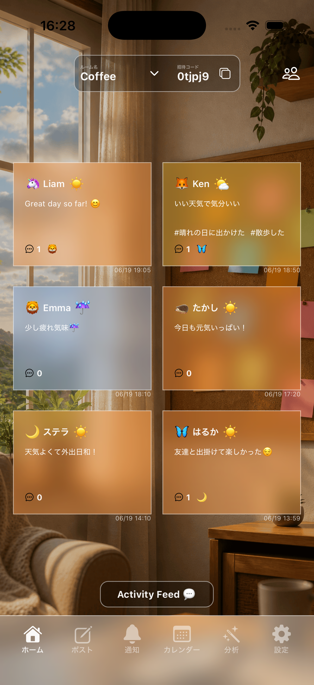 | 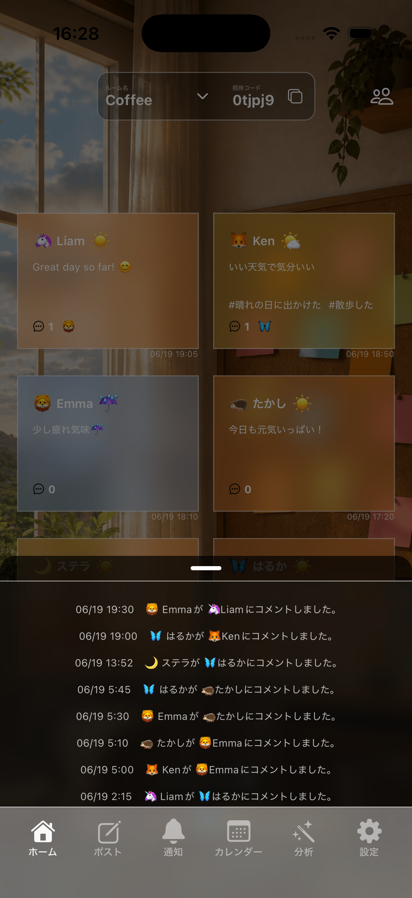 | 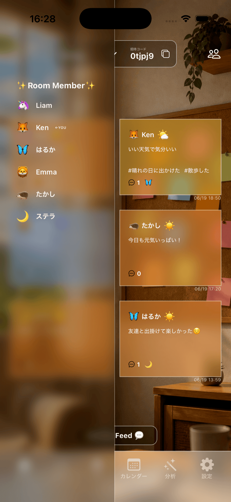 |

| コメント | 投稿 | ヒストリーカレンダー |
|---|---|---|
| 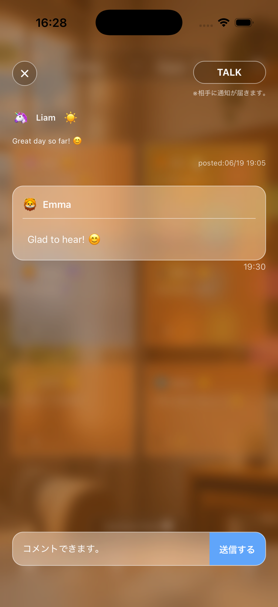 | 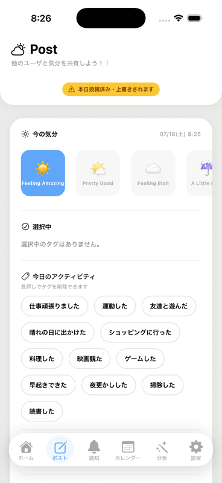 | 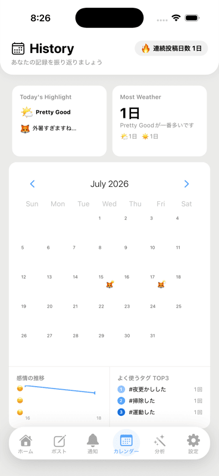 |

| ヒストリー詳細 | AI分析 | AI分析履歴 |
|---|---|---|
| 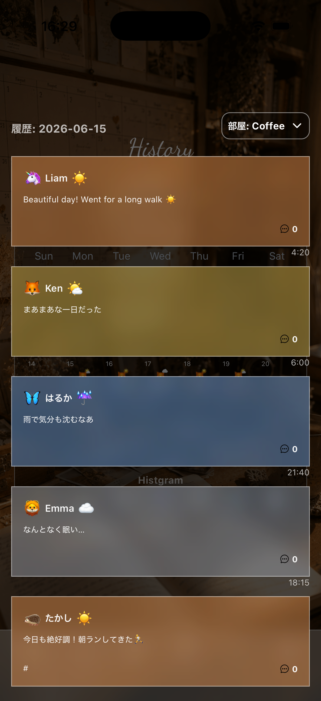 | 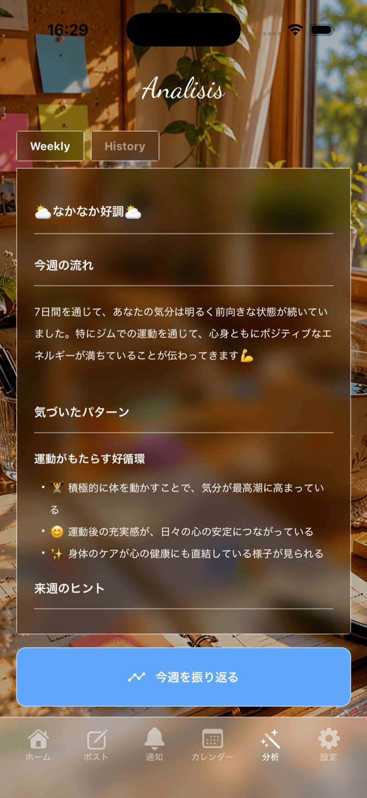 | 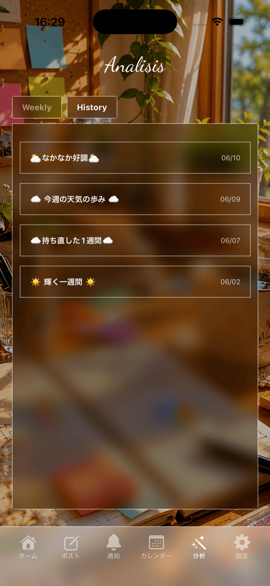 |

| 通知 | ログイン | サインアップ |
|---|---|---|
| 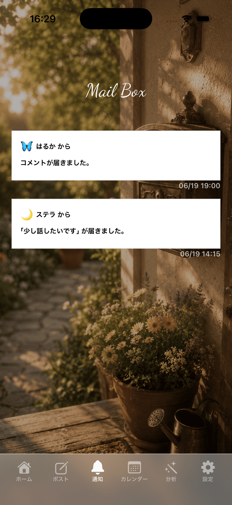 | 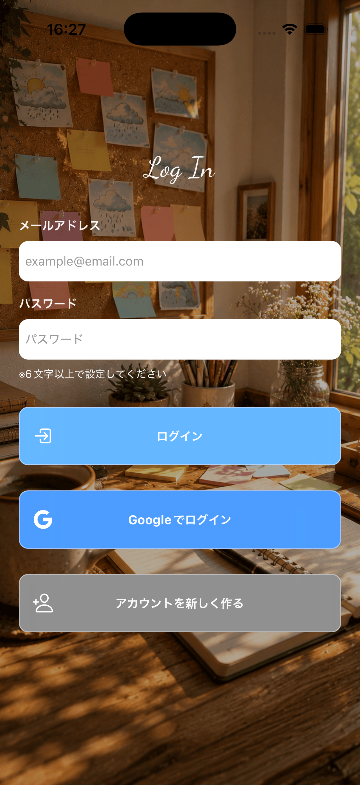 | 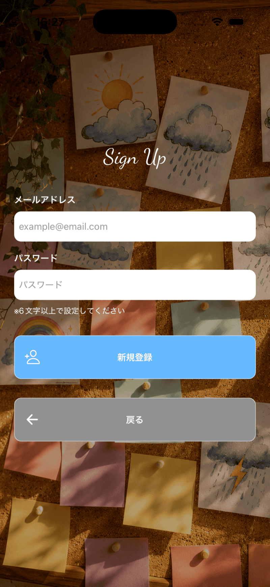 |

| EULA | 設定 | アカウント設定 |
|---|---|---|
| 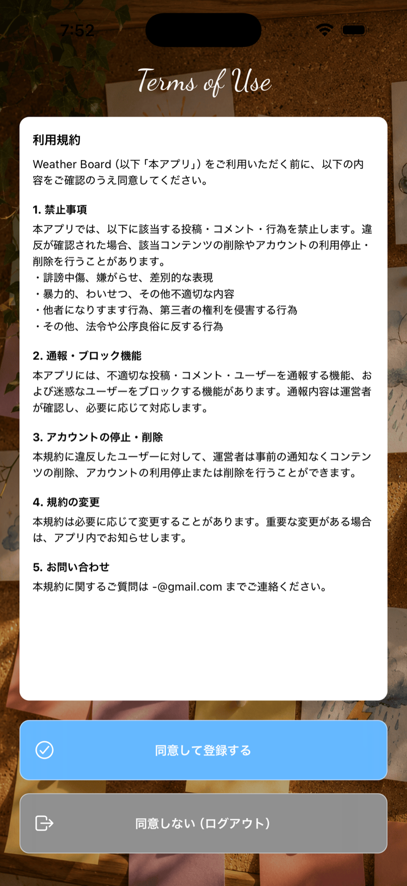 | 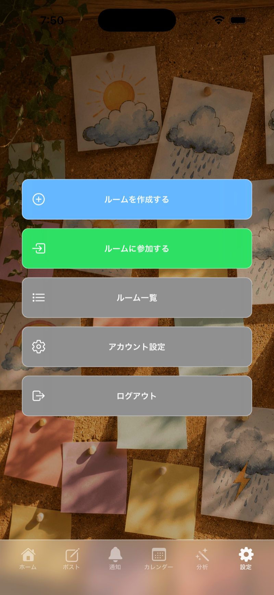 | 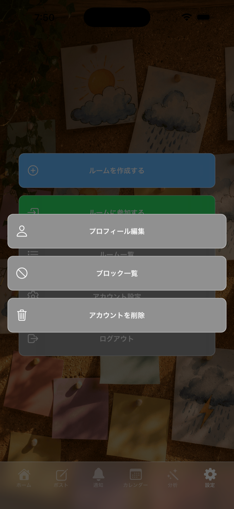 |

| 投稿画面のキーボード回避 | コメント画面のキーボード回避 | 通報・ブロックメニュー |
|---|---|---|
| 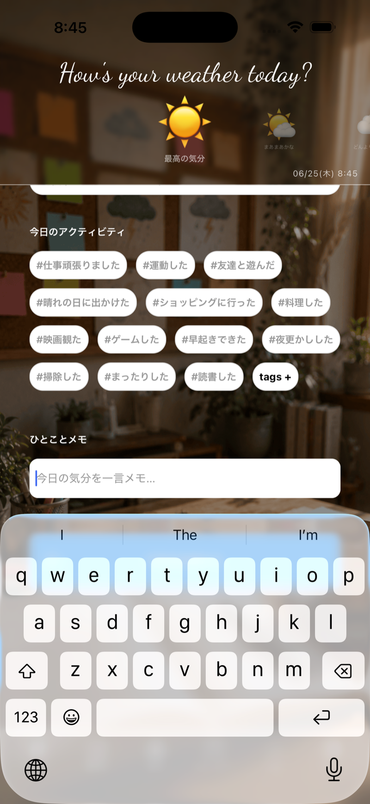 | 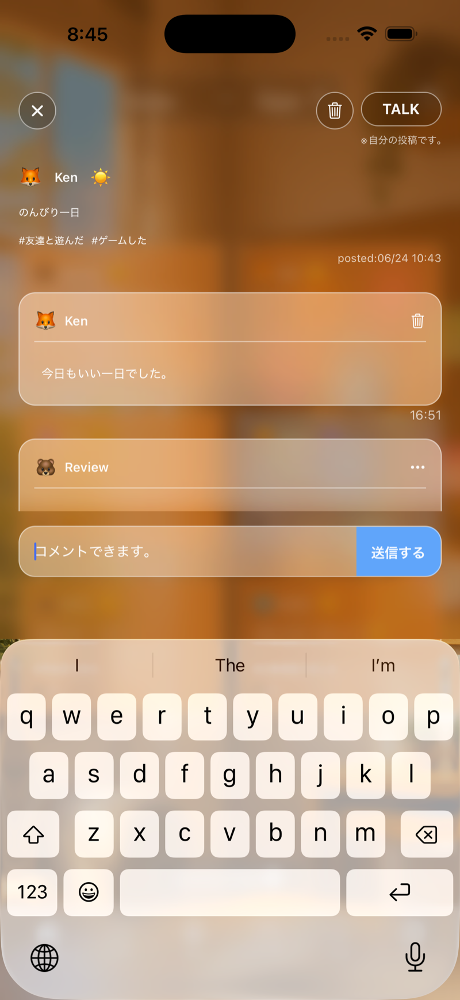 | 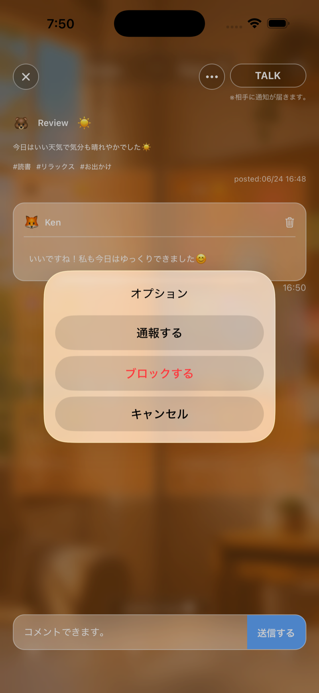 |

## セットアップ

```bash
# パッケージのインストール
npm install

# 環境変数の設定
cp .env.example .env
# .env に Supabase の URL・APIキー・Anthropic APIキーを記入

# 起動
npx expo start
```

## 作者

GitHub: [Kensuke775](https://github.com/Kensuke775)
